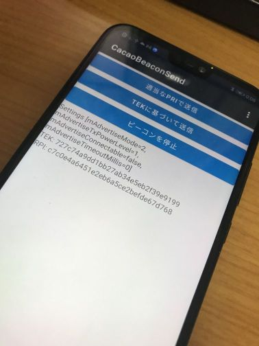

# CacaoBeacon

- 接触通知(Exposure Notification)のAPIを自前実装する試み

# Requirement
 
- .NET 5
- Xamarin.Android


# フォルダ構成

- lib: 足回りのライブラリ CacaoBeacon.Lib
- consolerecv: Windows コンソールで Beacon を受信するテストプログラム
- probetek: json/zip をダウンロードして、内部の TEK を取得するテストプログラム
- CacaoBeaconMonitor: Android 上で Beacon を受信するプログラム
- CacaoBeaconSend: Android 上でビーコンを発信するプログラム

## probetek

- 指定URLからJSONをダウンロードして、TEK入りのZIPリストを取得する

[rocaz/probeCOCOATek: Probe TemporaryExposureKeys and Files of Exposure Notifications System in Japan a\.k\.a\. "COCOA"\.](https://github.com/rocaz/probeCOCOATek) の .net 版です

$ dotnet run 

```
count: 118
1: 2021/09/04 15:00:36 https://covid19radar-jpn-prod.azureedge.net/c19r/440/5713.zip
2: 2021/09/05 15:00:18 https://covid19radar-jpn-prod.azureedge.net/c19r/440/5718.zip
3: 2021/09/05 15:00:30 https://covid19radar-jpn-prod.azureedge.net/c19r/440/5726.zip
4: 2021/09/06 15:00:06 https://covid19radar-jpn-prod.azureedge.net/c19r/440/5731.zip
5: 2021/09/06 15:00:12 https://covid19radar-jpn-prod.azureedge.net/c19r/440/5732.zip
6: 2021/09/06 15:00:22 https://covid19radar-jpn-prod.azureedge.net/c19r/440/5743.zip
7: 2021/09/07 15:00:38 https://covid19radar-jpn-prod.azureedge.net/c19r/440/5744.zip
```

- 上記で取得した URL から zip ファイルをダウンロードして内部の TEK リストを取得する

$ dotnet run [zip-url]

```
TEK export
StartTimestamp: 1630800000 2021/09/05 0:00:00
EndTimestamp: 1630886400 2021/09/06 0:00:00
Region: 440
BatchNum: 1
BatchSize: 1
SignatureInfo.Count: 1
 VerificationKeyVersion: v1
 VerificationKeyId: 440
 SignatureAlgorithm: 1.2.840.10045.4.3.2
Keys.Count: 3
1: 88bcf39bd2dd91a56f9b5b14f9555a9e
 TransmissionRiskLevel: 4
 RollingStartIntervalNumber: 2718000 2021/09/05 0:00:00
 RollingPeriod: 144
2: 3ea3bd6f8f8a77052f00bd94bb1ec1c4
 TransmissionRiskLevel: 4
 RollingStartIntervalNumber: 2718000 2021/09/05 0:00:00
 RollingPeriod: 144
 ...
 ```

## consolerecv

Windows 10 で接触確認アプリ（COCOA等）のビーコンを受信するプログラム

$ dotnet run 

```
----------------
received 2021/09/19 21:52:36
MAC: 3E:7B:13:71:AB:AB
NAME:
ServiceUuids count:1
uuid: 0000fd6f-0000-1000-8000-00805f9b34fb
dataSections count:3
 type: 01 size: 1 data: 1A
 type: 03 size: 2 data: 6F-FD
 type: 16 size: 22 data: 6F-FD-CD-6A-C2-FC-F7-70-82-D0-3F-A0-1B-04-F1-71-E5-87-F7-08-89-E2
manufactures count:0
---
[c3415c96c8ecc314726feecddec0bfac] 2021/09/19 21:52:35 2021/09/19 21:52:35 -37 -34 dBm 4E:6D:F4:92:6D:9D
[3f8b686511851e42ee78a8ffe35ea727] 2021/09/19 21:52:35 2021/09/19 21:52:37 -69 -63 dBm 27:91:B1:93:78:E9
[cd6ac2fcf77082d03fa01b04f171e587] 2021/09/19 21:52:36 2021/09/19 21:52:36 -45 -45 dBm 3E:7B:13:71:AB:AB
---
** MAC: 27:91:B1:93:78:E9 at received 2021/09/19 21:52:37 rssi:-63
---
[c3415c96c8ecc314726feecddec0bfac] 2021/09/19 21:52:35 2021/09/19 21:52:38 -37 -34 dBm 4E:6D:F4:92:6D:9D
[3f8b686511851e42ee78a8ffe35ea727] 2021/09/19 21:52:35 2021/09/19 21:52:37 -69 -63 dBm 27:91:B1:93:78:E9
[cd6ac2fcf77082d03fa01b04f171e587] 2021/09/19 21:52:36 2021/09/19 21:52:36 -45 -45 dBm 3E:7B:13:71:AB:AB
---
** MAC: 4E:6D:F4:92:6D:9D at received 2021/09/19 21:52:38 rssi:-34
---
[c3415c96c8ecc314726feecddec0bfac] 2021/09/19 21:52:35 2021/09/19 21:52:38 -37 -34 dBm 4E:6D:F4:92:6D:9D
[3f8b686511851e42ee78a8ffe35ea727] 2021/09/19 21:52:35 2021/09/19 21:52:37 -69 -63 dBm 27:91:B1:93:78:E9
[cd6ac2fcf77082d03fa01b04f171e587] 2021/09/19 21:52:36 2021/09/19 21:52:38 -52 -45 dBm 3E:7B:13:71:AB:AB
---
...
```

## CacaoBeaconMonitor CBモニタ

Android で、接触確認アプリ(COCOA等)のビーコンを受信するプログラム

- 権限で「位置通知」を有効にする


## CacaoBeaconSend CB送信

Android で、接触確認アプリ(COCOA等)のビーコンを送信するプログラム

- 権限で「位置通知」を有効にする
- Google サービスで「COVID-19接触確認システム」をOFFにする（あるいは、接触確認アプリを入れていない機種を使う）



# 参考先

- [Exposure Notification - Bluetooth Specification](https://covid19-static.cdn-apple.com/applications/covid19/current/static/contact-tracing/pdf/ExposureNotification-BluetoothSpecificationv1.2.pdf)
- [Exposure Notification - Cryptography Specification](https://covid19-static.cdn-apple.com/applications/covid19/current/static/contact-tracing/pdf/ExposureNotification-CryptographySpecificationv1.2.pdf)
- https://developers.google.com/android/exposure-notifications/exposure-notifications-api
- https://developer.apple.com/documentation/exposurenotification


# License

- GNU General Public License
- Copyright (c) 2021 openCACAO & moonmile.net
